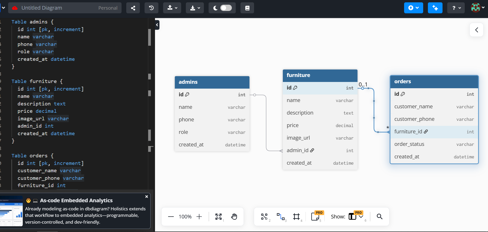

📐 Furniture Ordering Platform – dbdiagram Schema

Table admins {
id int [pk, increment]
name varchar
phone varchar
role varchar
created_at datetime
}

Table furniture {
id int [pk, increment]
name varchar
description text
price decimal
image_url varchar
admin_id int
created_at datetime
}

Table orders {
id int [pk, increment]
customer_name varchar
customer_phone varchar
furniture_id int
order_status varchar
created_at datetime
}

Ref: furniture.admin_id > admins.id
Ref: orders.furniture_id > furniture.id

---

---

✅ Admin

Tolosa & Fetsum can be stored here
Controls furniture (CRUD)
Can scale later (roles like super_admin)

✅ Furniture

Uploaded only by admin
Visible to everyone (no login required)
Price & image supported

✅ Orders

Client does not need an account
Only name & phone required
Linked to furniture

🔗 Relationships Explained

One Admin → Many Furniture
One Furniture → Many Orders

